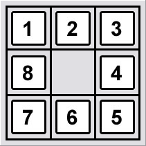

# CPP 8 puzzle steps solver - BSF Game
# Developer: Kareem Ateeqi
 sees how much steps taken to use 8 puzzle using Breadth First Search (BFS)

 For information about 8 puzzle click [HERE](https://www.aiai.ed.ac.uk/~gwickler/eightpuzzle-uninf.html):

 To run this project:
 download the files from the "code" folder

 -ensure that you have a cpp compiler such as clang++ or g++ and doxygen (the c++ version javadoc or jsdoc) :
 If you are mac user you can refer to [here](https://formulae.brew.sh/formula/doxygen) to install  
 If you are a windows user you can refer to [here](https://www.doxygen.nl/manual/install.html)

-run the following line:

"make" 
"./a.out" 

You will then be directed to enter a puzzle. Unfortunately this program does not come with a gui. Instead you will enter nine numbers in a row with a zero representing a whole  

for example, lets say I have this: 
 

in the program I would run with each new line representing an enter:

./a.out 
8 
7 
6 
0 
4 
1 
2 
5 
3 
